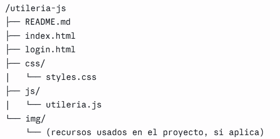
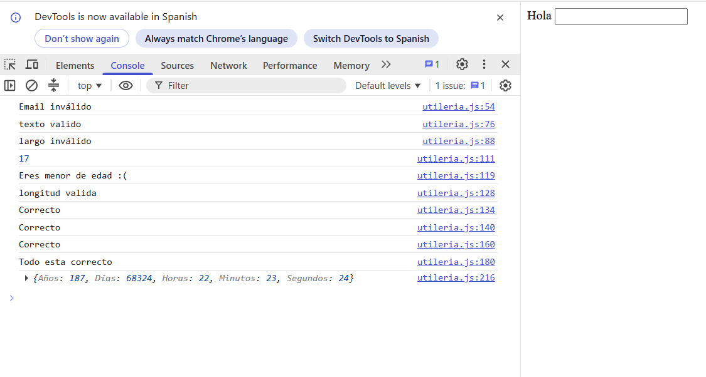
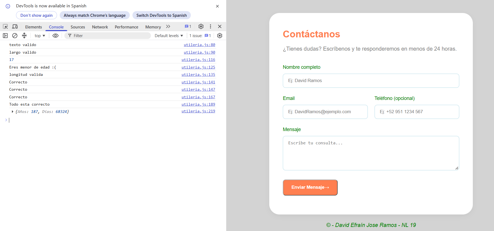
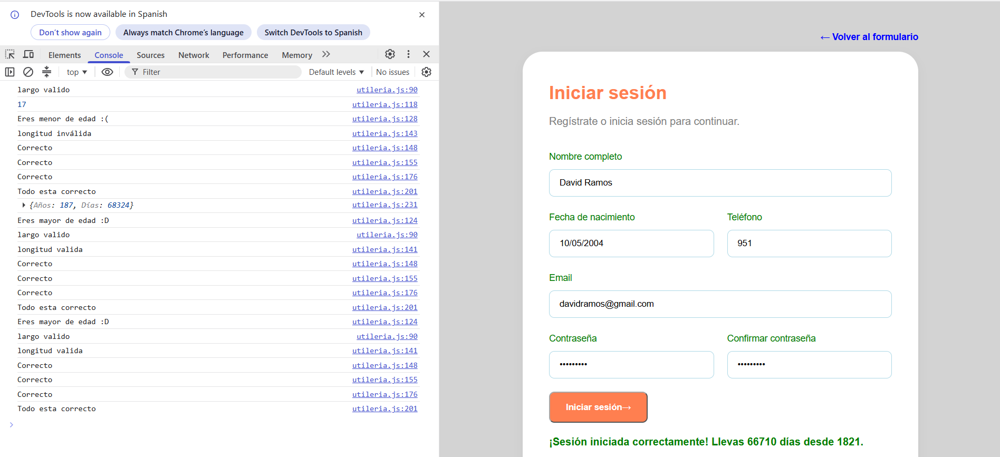

# Actividad dos - Mi primera librería en JavaScript
## La librería se llama utilería y son 6 funciones en JavaScript con dos extras creadas por nosotros. 
Todo lo anterior se va a enlazar con un index y un login en GithubPages siguiendo la siguiente 
estructura:
***
#### Elaborado por: David Efraín José Ramos NL 19
## Problema que resuelvo
Realmente las funciones que aquí se plantean funcionan más en un formulario de cualquier pagina web con la finalidad de tal vez tener datos estadísticos. Por ejemplo, nosotros queremos obtener edades de nuestros principales consumidores. Nosotros como programadores no podemos dejarlo libre ya que muchos usuarios pueden equivocarse y si se equivocan es posible de que no tengamos datos exactos.
***
### Instalación en un html con etiqueta 
```html
<link rel = "stylesheet" href = "css/utileria.css">
```


### Primera función - Validar Correo 
Esta función valida primero desde una expresión regular, luego separa el nombre del usuario y del dominio para verificar que ambos no estén vacíos y que no tengan caracteres especiales.
Resive de valor el email:
```js
function validarEmail(email) {}
```
### Segunda función - Validar que sean solo letras
En esta segunda función se nos solicita que validemos una cadena caracteres donde solo aparezcan letras mayúsculas o minúsculas e inclusive acentuadas. Para lograr eso utilice  una expresión regular.
```js
function validarTexto(text) {}
```
### Tercera función - Validar longitud
Esta estuvo interesante porque pedía dos variables la de la cadena y el limite. Se logro gracias a un if:
```js
function validarLongitud(long, maxLong) {}
```
### Cuarta función - Calcular la edad a partir de la fecha de nacimiento
Para lograrlo tuve que usar una función llamada 'Date.now()' y restarla con la fecha puesta no sin antes separar el arraylist en tres partes para poder restarlas.
```js
function calcularEdad(fechaNacimiento) {}
```
###  Quinta función - Validar si el usuario es mayor de edad a partir de su fecha de nacimiento. 
Esta fue un poco fácil obteniendo la edad con la función anterior. Al final solo es usar un if.
```js
function esMayorDeEdad (edad) {}
```
### Sexta función - Validar un password 
En esta función tuve que poner varios if como para validar que tuviera una longitud máxima, una letra minúscula, al menos un numero como para validar que no tuviera espacios en blanco y que tuviera al menos un carácter especial. 
```js
function validarPassword(password) {}
```
### Séptima función (propia) - Validar que el password sea igual
En la mayoría de registros siempre piden que verifiques que coincida la contraseña y creí que era buena opción implementarla con un if.
```js
function validarPasswords(password, password2) {} 
```
### Octava función - ¿Cuántos días han pasado desde la independencia de Mexico?
La verdad en este punto ya no tenia ideas y como septiembre es un mes patrio se me hizo una excelente idea saber cuantos días y años han pasado desde la independencia de Mexico. Utilice como referencia la calculadora de edad. 
```js
function calcularTiempo(fecha) {} 
```
### Captura de pantalla de los ejercicios en consola
Aquí utilice una prueba experimental de cuanto finalice todas las funciones. 




### Index.html
En el index se añadio una especie de formulario y en 'iniciar sesión' es donde realmente sucede la magia.
#### Elaborado por: David Efraín José Ramos
